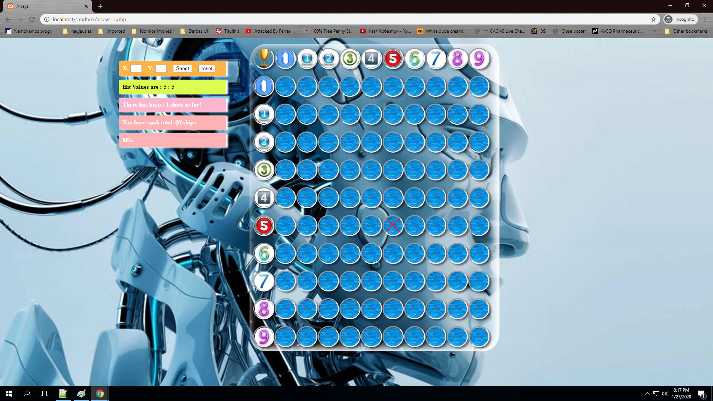

# PHP
<h1> BATTLESHIP GAME IN A PHP MANNER! Here i am doing a BATTLESHIP  game in PHP  <h1/>

	After running >100000 given ships array placing simulations on a 0.1s interval there are no errors.
	The given array consists of :    1 ship length 4
					 2 ships length 3
					 3 ships length 2
					 4 ships length: 1 
				

Every ship must be placed in a way it does not have adjacent ships around it.

Check function is checking the ship placement possibility. If there is a way to place the ship - the ship will be placed. If not starting coordinates will be changing with placing option untill there is a possibility to place the ship. 

								One starting point has 4 ways to place the ship(up, down,right,left). There are 100 circles so starting points. There are 4^100 possibilities to place the ship if the ship has a
								length of 1. Sure visualy you wont see the difference but from the placing perspective it is different. With the ship length increasing the possibilty of placing ship is deteriorating due
								to the fact that the ship might go out of 10x10  array matrix. 
 
